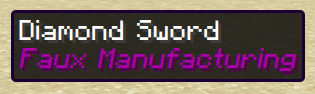

# Tagging
Ownership of items in a standard Minecraft server often relies solely on knowledge or direct possession of any given item. In a real-world scenario, a company will tag, label, or otherwise inscribe their insignia to their product, for consumers to recognize them by.
## Approach
In order to simulate the previous example, attributing data to an item that gives a player knowledge of what nation, organization, or individual created the item they are in possession of.

"Tagging" an item is the proposed solution. The process would go as follows:

A player wishes to tag a batch of processed items with their username. They;  
1. Input their username onto a written book.
2. Input the book into a "tagging factory".
3. Run their item batch through the factory, resulting in the items being lored with said item.

An example of the resulting item:\

More in-depth uses for tagging is described in [Currency](../economics/Currency.md).